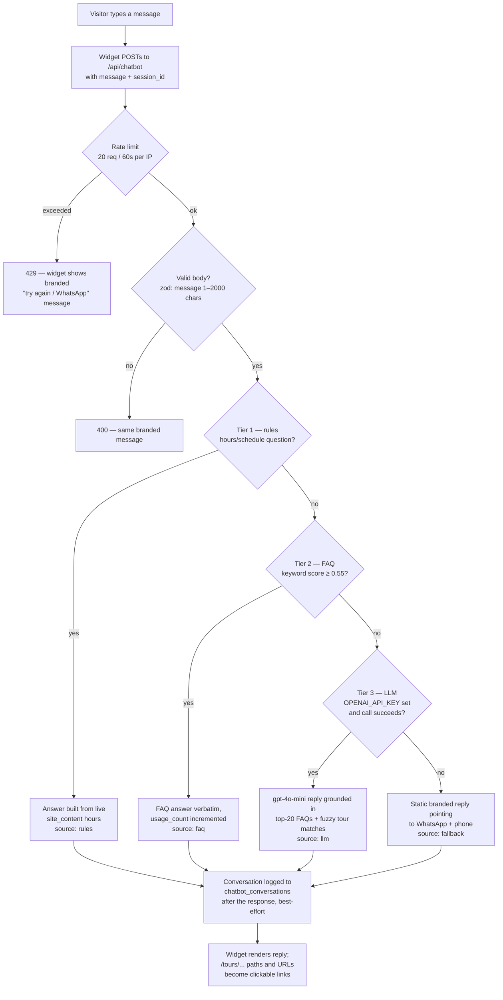

# Customer-Service Chatbot

A floating chat widget on every customer-facing page that answers questions about
hours, bookings, payments, and tours. It uses a **tiered answer pipeline** —
cheapest and most reliable source first — so most questions never touch the LLM,
and the bot keeps working even with no `OPENAI_API_KEY` configured.

## File map

| Piece | File |
| --- | --- |
| Chat widget (client) | `components/Chatbot.tsx` — mounted in `app/(site)/layout.tsx` |
| API route | `app/api/chatbot/route.ts` (`POST /api/chatbot`) |
| Answer pipeline (server-only) | `lib/ai/chatbot.ts` |
| Pure matching logic + tests | `lib/ai/chatbot-rules.ts`, `lib/ai/chatbot-rules.test.ts` |
| Request schema | `chatbotRequestSchema` in `lib/schemas.ts` |
| Database (tables, RLS, RPCs, FAQ seeds) | `supabase/migrations/0015_chatbot.sql` |

## Conversational flow

## The four tiers

### Tier 1 — deterministic rules (`source: "rules"`)

Questions like *"What are your hours?"*, *"When do you open?"*, *"What's your
schedule?"* are detected by regex (`isHoursQuestion` in `lib/ai/chatbot-rules.ts`)
and answered **directly from the live `site_content.business_contact.hours`
setting** — never from a stale FAQ and never by the LLM, so an admin editing
hours in `/admin/content` changes the bot's answer immediately.

**The "open right now?" exclusion:** phrasings like *"Are you open right now?"*
or *"Are you currently open?"* are deliberately excluded from this rule, because
answering them requires reasoning about what time it is *now*. Those go to the
LLM, whose system prompt includes the current date/time in `America/Guyana` plus
the hours text, so it can reason: "it's Sunday 9 PM, hours say 'Sunday · By
appointment' → we're not open right now, but…".

### Tier 2 — FAQ keyword match (`source: "faq"`)

Active rows from the `faqs` table are scored against the message with a cheap
keyword-overlap function (no LLM involved): the message is tokenized
(lowercased, stopwords dropped), and each distinct token is counted against the
FAQ's curated `keywords` array (double weight) and its question words, then
normalized to [0, 1]. If the best FAQ scores **≥ 0.55**, its answer is returned
**verbatim** and its `usage_count` is bumped (fire-and-forget RPC). Example:
*"do I need a passport for the tour?"* → the passport FAQ.

### Tier 3 — LLM with retrieved context (`source: "llm"`)

Anything else goes to **OpenAI `gpt-4o-mini`** (max 400 tokens), grounded by a
system prompt containing:

- the assistant role for Mista Concierge Travel,
- the current Guyana date/time and the hours text,
- rules: 1–3 sentences, prices only in GYD and only from provided figures,
  quote FAQs rather than paraphrase, recommend 1–3 tours as `/tours/{slug}`
  links, never invent tours/prices/availability/policies, defer to
  WhatsApp/phone when unsure,
- the top 20 FAQs (by usage) as Q/A pairs,
- tour matches from the `search_tours` RPC — fuzzy `pg_trgm` matching over tour
  title, location, destination name, and overview, low-score rows dropped.

### Tier 4 — static fallback (`source: "fallback"`)

If no key is configured or the OpenAI call fails, the visitor gets a friendly
branded message pointing to WhatsApp and the phone number (pulled live from
`business_contact`). The bot is fully functional without any LLM key — tiers 1,
2, and 4 cover it.

## Sessions, logging, and privacy

- The widget generates one `session_id` per browser (`crypto.randomUUID()`,
  stored as `mc-chat-session` in localStorage) and sends it with every message,
  so a visitor's exchanges group into a conversation.
- Every exchange is logged to `chatbot_conversations` (session, user message,
  bot reply, matched FAQ, confidence score) **after** the response is sent
  (`after()` from `next/server`) — logging failures never break a reply.
- Row-level security: anyone can insert a log row, **only admins can read
  them** (`is_admin()`); visitors can never read chat logs back out.
  `was_helpful` is reserved for a future thumbs-up/down UI.

## Managing FAQs & reviewing conversations (admin)

The **Chatbot** section of the admin panel (`/admin/chatbot`, sidebar entry with
its own permission grant) manages everything:

- **FAQs tab** — create, edit, activate/deactivate, and delete FAQs; manage the
  optional categories inline. Ten FAQs are seeded by the migration.
  - **Answer text** is returned verbatim — write it customer-ready.
  - **Keywords** drive matching: comma-separated, lowercase, the terms a
    customer would actually type (`cancel, cancellation, refund, reschedule`).
    Keywords count double vs. question words.
  - **Inactive** FAQs are hidden from both matching and the LLM context.
  - **Used N×** shows what customers actually ask — the top 20 by usage are
    also what the LLM sees as context.
- **Conversations tab** — the latest 50 logged exchanges, searchable by
  session/message text, each showing the matched FAQ + confidence when tier 2
  answered; entries can be deleted.
- The match threshold (`FAQ_THRESHOLD = 0.55`) lives in
  `lib/ai/chatbot-rules.ts`; raise it if wrong FAQs fire, lower it if too much
  traffic falls through to the LLM.

## Configuration & limits

| Setting | Where | Behavior |
| --- | --- | --- |
| `OPENAI_API_KEY` | `.env.local` (optional) | Enables tier 3. Unset → tiers 1/2/4 still answer. |
| Rate limit | `app/api/chatbot/route.ts` | 20 requests / 60s per IP → 429. In-process only; swap to Upstash/Redis for multi-instance deploys. |
| Hours, WhatsApp, phone | `site_content.business_contact` (admin → Content) | Read live on every request; no redeploy needed. |
| Timezone | `TIMEZONE` in `lib/ai/chatbot.ts` | `America/Guyana`, used for the LLM's clock. |

## Accessibility notes

The panel is a `role="dialog"` with a focus trap, Escape-to-close, and focus
return to the launcher button; the message list is a polite `aria-live` log.
Input auto-focus only happens for fine pointers (no surprise mobile keyboard),
body scroll locks only on touch devices, and the typing indicator respects
`prefers-reduced-motion`.
